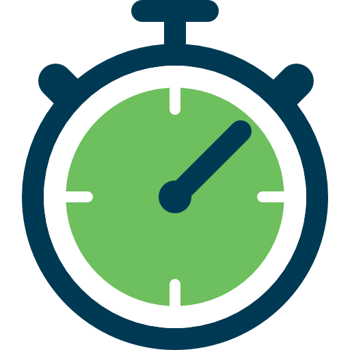

<!-- PROJECT SHIELDS -->
<!--
*** I'm using markdown "reference style" links for readability.
*** Reference links are enclosed in brackets [ ] instead of parentheses ( ).
*** See the bottom of this document for the declaration of the reference variables
*** for contributors-url, forks-url, etc. This is an optional, concise syntax you may use.
*** https://www.markdownguide.org/basic-syntax/#reference-style-links
-->

[![LinkedIn][linkedin-shield]][linkedin-url]

<!-- PROJECT LOGO -->
 

  

<h3 align="center">AbleToTrack</h3>
  

    A simple, lightweight time management tool 
  

<!-- ABOUT THE PROJECT -->
## About the project

This is the backend for the AbleToTrack application.

## Built with
* [Kotlin][Kotlin-url]
* [Spring Boot][SpringBoot-url]
* [Gradle][Gradle-url]

## Prerequisites

The following software needs to be installed:

* JDK version 17+.
* A recent version of your favorite Java IDE (Eclipse, NetBeans, Intellij IDEA)

## Installation

1. Clone the repo.
2. Run the gradle project from your IDE.

<!-- MARKDOWN LINKS & IMAGES -->
<!-- https://www.markdownguide.org/basic-syntax/#reference-style-links -->
[linkedin-shield]: https://img.shields.io/badge/-LinkedIn-black.svg?style=for-the-badge&logo=linkedin&colorB=555
[linkedin-url]: https://linkedin.com/in/byronsdec

[SpringBoot-url]: https://spring.io/projects/spring-boot
[Kotlin-url]: https://kotlinlang.org/
[Gradle-url]: https://gradle.org/